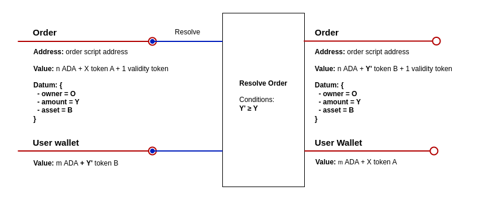
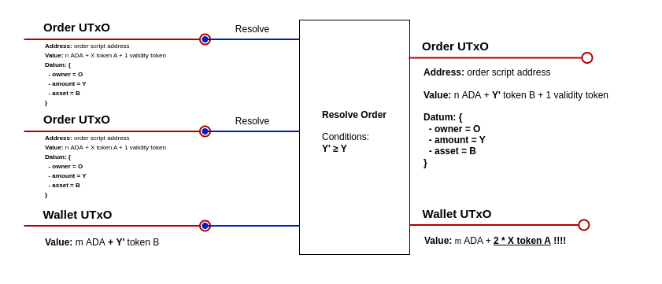

# Good practices for validator code

## Intro

Validators are...

* sensitive code: millions can be lost
* complex: composable!
* not taken seriously: lot of code&fix
* software: +60 years of software engineering
* new: more literature is needed

## Example: Order Book

A seller offers an amount of tokens A in exchange for an amount of tokens B.

Three operations:
* create order
* resolve order
* close order

Two validators (or one multi):
* spend order
* mint validity token

## Example: Resolve order



## Writing the checks

* Group the checks logically, like:
  1. inputs conditions and redeemers
  2. required tokens and signatures
  3. validity range
  4. minting
  5. outputs
* Use comments to explain what is going on
* **Write for humans**: validators are literature

## About the process

Our best experience:

* Start with True validators
* Write off-chain tests
* Iterate:
  * Write checks
  * Run tests
* **Very** short iterations
* Debug using traces
* Work top down

## Iteration 0

True validator:

```
    spend(
      _datum: Option<OrderDatum>,
      redeemer: OrderRedeemer,
      _own_ref: OutputReference,
      _self: Transaction,
    ) {
      when redeemer is {
        Resolve -> True
        Close -> True
      }
    }
```

[Complete code](order-book/validators/order_0.ak)

[Lucid emulator tests](order-book/tests/integration.ts)

Commands:

```
$ aiken build --trace-level verbose
$ deno run -A https://deno.land/x/lucid/blueprint.ts
$ deno tests/integration.ts
```

## Checking outputs

* Rely on ordering: "sort, don't search"
* Check all fields:
  * Address, both parts:
    * payment
    * staking
  * Value
  * Datum
  * Reference script
* If a field is free, be explicit about it
* Use pattern matching

## Iteration 1

Check continuation output:

```
    // checks for continuation output
    expect [cont_out, ..] = outputs

    expect Output {
      address: cont_addr,
      value: cont_value,
      datum: InlineDatum(cont_datum),
      reference_script: None,
    } = cont_out

    let cont_has_correct_addr = cont_addr == own_in.output.address

    cont_has_correct_addr?
```

[Complete code](order-book/validators/order_1.ak)

## Checking values

* Consider all possible assets:
  * lovelace
  * relevant assets
  * other assets (prevent spam!)
* Min ADA issues:
  * if UTxO grows in size, more may be needed
  * if UTxO shrinks, some can be taken

## Iteration 2

Check continuation output value.

Is this correct?:
```
    and {
      quantity_of(cont_value, own_hash, "val") == 1,
      quantity_of(cont_value, policy_id, asset_name) >= amount,
    }
```

- can add/remove ADA? Yes
- can add/remove val token? No
- can leave some token A? Yes
- can add more token B? Yes
- can include other tokens? Yes

What about this?:
```
    let in_lovelace = lovelace_of(own_in.output.value)
    let expected_value = from_lovelace(in_lovelace)
      |> add(own_hash, "val", 1)
      |> add(policy_id, asset_name, amount)
    match(cont_value, expected_value, >=)
```

- can add/remove ADA? Only add
- can add/remove val token? No
- can leave some token A? No
- can add more token B? No
- can include other tokens? No

Maybe too restrictive. And this?:
```
    let in_lovelace = lovelace_of(own_in.output.value)
    and {
      lovelace_of(cont_value) >= in_lovelace,
      quantity_of(cont_value, own_hash, "val") == 1,
      quantity_of(cont_value, policy_id, asset_name) >= amount,
      length(flatten(cont_value)) == 3,
    }
```

- can add/remove ADA? Only add
- can add/remove val token? No
- can leave some token A? No
- can add more token B? Yes
- can include other tokens? No

[Complete code](order-book/validators/order_2.ak)

## Checking datums

* Inline data are the current default
* Prefer entire datum comparisons
* [Destructure](https://aiken-lang.org/language-tour/custom-types#destructuring):
```
    expect Some(OrderDatum { owner, amount, policy_id, asset_name }) = datum
```

* [Update](https://aiken-lang.org/language-tour/custom-types#updating-custom-types):

Example for a partial fill of an order:
```
    let expected_cont_datum = OrderDatum {
      ..datum,
      amount: datum.amount - filled_amount,
    }
    cont_datum == expected_cont_datum
```

## Iteration 3

Check continuation output datum:
```
        let cont_has_correct_datum = {
          expect cont_datum: OrderDatum = cont_datum
          Some(cont_datum) == datum
        }
```

[Complete code](order-book/validators/order_3.ak)

## Double satisfaction



## Avoiding double satisfaction

Some options:

1. New address for each order
   * validator parameterized on seed UTxO
2. Tagged outputs
   * in value: make validity an NFT
     * Unique policy: see 1
     * Unique token name: hash a seed UTxO
   * In datum:
     * add 
3. Restrict inputs
   * explicit checks limiting script inputs

## Iteration 4 (and last!)

Restrict inputs:
```
  // exactly one order is being spent (avoids double satisfaction)
  let tx_has_one_order_inputs =
    list.length(
      list.filter(
        inputs,
        fn(input) { input.output.address == own_in.output.address },
      ),
    ) == 1
```

[Complete code](order-book/validators/order.ak)

## Final remarks

* Write a specification document
  * Do the diagrams!
* Keep It Simple
  * Do not overengineer
  * Do not over-modularize ("functionitis")
* Look for beauty
* Develop a standard: all validators should look the same

## More to come

So many things can be checked in [transactions](https://aiken-lang.github.io/stdlib/cardano/transaction.html#Transaction
):

```
Transaction {
  inputs: List<Input>,
  reference_inputs: List<Input>,
  outputs: List<Output>,
  fee: Lovelace,
  mint: Value,
  certificates: List<Certificate>,
  withdrawals: Pairs<Credential, Lovelace>,
  validity_range: ValidityRange,
  extra_signatories: List<VerificationKeyHash>,
  redeemers: Pairs<ScriptPurpose, Redeemer>,
  datums: Dict<DataHash, Data>,
  id: TransactionId,
  votes: Pairs<Voter, Pairs<GovernanceActionId, Vote>>,
  proposal_procedures: List<ProposalProcedure>,
  current_treasury_amount: Option<Lovelace>,
  treasury_donation: Option<Lovelace>,
}
```

## Other random topics

* Chain of `expect` or big final expression?
* Naming of variables, types and functions
* Composition
* Circularities
* Optimization
* Withdraw-zero trick
* Batchers
* etc etc etc....................

## Links and references

Software:
* [Aiken](https://aiken-lang.org/)
* [Lucid](https://lucid.spacebudz.io/)
  * powered by [Pallas](https://github.com/txpipe/pallas/)
* [Lace anatomy](https://laceanatomy.com/)

Documentation:
* [Cardano ledger](https://github.com/IntersectMBO/cardano-ledger) (the bible)
* [Aiken's EUTxO crash course](https://aiken-lang.org/fundamentals/eutxo)
* [Debugging plutus](https://www.joinplank.com/articles/debugging-plutus-an-introduction-to-low-level-cardano-transactions-in-the-alonzo-era)
